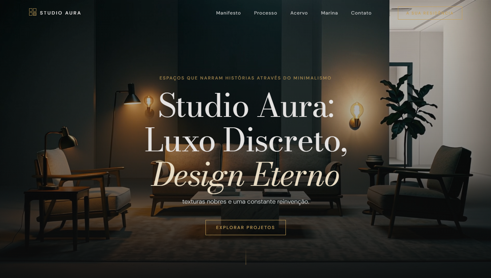

# Studio Aura — Luxo Discreto, Design Eterno

> *"O luxo não grita. Ele se revela no silêncio dos detalhes."*
> — Marina Vasconcelos, Fundadora

<br>

## Visão Geral

Landing page imersiva para um estúdio de arquitetura e design de interiores de alto padrão em São Paulo. O objetivo não era apenas exibir projetos — era fazer o visitante **sentir** o ambiente antes mesmo de ler uma palavra.

A experiência foi construída ao redor de um princípio único: **cada interação deve ter peso**.

<br>

## Preview

### Desktop



### Mobile

> *Captura mobile em breve.*

<br>

## Funcionalidades

- **Hero com vídeo imersivo** — entrada cinematográfica com animações em sequência via GSAP
- **Video scrubbing por scroll** — o vídeo do processo é controlado pelo scroll do usuário, quadro a quadro (end → start), criando uma narrativa visual única
- **Smooth scroll customizado** — implementado manualmente com `requestAnimationFrame` e proxy do ScrollTrigger, sem biblioteca externa
- **Reveal animado por scroll** — elementos entram em cena conforme o usuário desce a página
- **Menu mobile em overlay** — painel fullscreen com smoked glass (glassmorphism) e tipografia serif de grande escala
- **Formulário com validação** — campos minimalistas com feedback visual e simulação de envio
- **Design system completo** — paleta, tipografia, espaçamento e componentes documentados em `DESIGN.md`

<br>

## Stack

| Camada | Tecnologia |
|---|---|
| Estrutura | HTML5 semântico |
| Estilo | CSS3 com variáveis customizadas |
| Animações | GSAP 3 + ScrollTrigger |
| Scroll | Custom smooth scroll (rAF + proxy) |
| Design | Google Stitch → PRD → DESIGN.md |
| Deploy | GitHub Pages |

<br>

## Arquitetura do Projeto

```
studio-aura/
├── index.html                  # Estrutura semântica completa
├── style.css                   # Design system + layout + animações CSS
├── app.js                      # GSAP, ScrollTrigger, smooth scroll, form
├── DESIGN.md                   # Sistema de design (cores, tipografia, espaçamento)
├── studio_aura_project_brief.md # Brief do projeto (cliente fictício)
└── screen.png                  # Preview desktop
```

<br>

## Design System

O sistema visual foi gerado via **Google Stitch** e exportado como PRD + `DESIGN.md`.

| Elemento | Decisão |
|---|---|
| Background | `#131313` — Obsidian charcoal |
| Accent | `#E9C176` — Champagne gold |
| Headline | Bodoni Moda — contraste extremo de stroke, referência ao universo fashion |
| Body | DM Sans — geométrica, sem competir com os títulos |
| Bordas | 0px de arredondamento — precisão arquitetural, sem "amizade" |
| Elevação | Tonal layering — sem sombras, profundidade por contraste de superfícies |

<br>

## Como Rodar Localmente

```bash
# Clone o repositório
git clone https://github.com/tuliovitor/aura.git

# Entre na pasta
cd aura

# Abra no navegador
# Basta abrir o index.html diretamente
# ou usar uma extensão como Live Server no VS Code
```

> Nenhuma dependência de instalação. GSAP carregado via CDN.

<br>

## Contexto de Criação

Projeto desenvolvido durante o **Dev em Dobro — Imersão Dev do Futuro (Dia 1)**, em maio de 2026.

O fluxo completo foi:
1. Brief e identidade visual gerados no **Google Stitch**
2. Exportação do PRD, paleta e `DESIGN.md`
3. Skills instaladas via terminal (`taste-skill` + `gsap-skills`)
4. Desenvolvimento com IA como acelerador — não como substituto do raciocínio
5. Deploy no GitHub Pages no mesmo dia

<br>

## Acesse

🔗 **Site ao vivo:** [tuliovitor.github.io/aura](https://tuliovitor.github.io/aura/)

<br>

---

Feito por **Túlio Vitor** • [LinkedIn](https://www.linkedin.com/in/tuliovitor) • [GitHub](https://github.com/tuliovitor)
